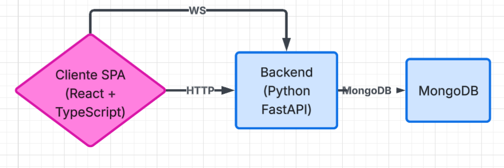
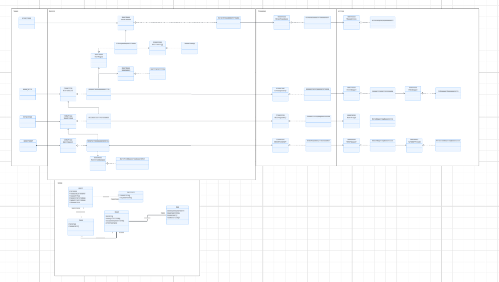
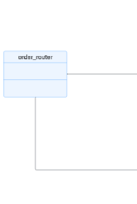
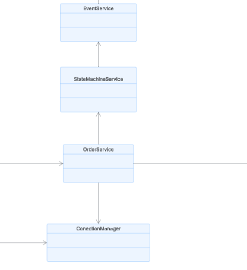
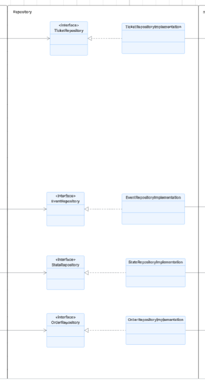
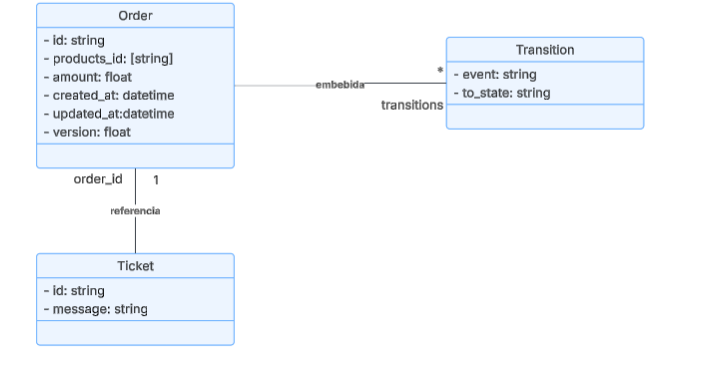

# StateMachineApp
---
## Architecture

At a high level, the system consists of a **single-page application (SPA)** client that communicates with a **FastAPI** backend. The client sends HTTP requests for CRUD operations and establishes a **WebSocket** connection to receive real-time state updates for orders.



### Frontend

The frontend is a **React + TypeScript** application organised into several layers, each with a clear responsibility:

- **`components/`** – Reusable presentational units (e.g., tables, modals, forms). They receive data via props and emit events.
- **`hooks/`** – Custom React hooks that encapsulate stateful logic and side effects (e.g., fetching orders, managing WebSocket connections).
- **`models/`** – TypeScript interfaces that define the shape of data (Order, Ticket, Event, etc.).
- **`pages/`** – Full-page components that combine hooks and components to implement specific views (OrdersPage).
- **`routes/`** – Routing configuration using React Router, including protected layouts and navigation.
- **`services/`** – Modules that abstract all API and WebSocket communication (e.g., `orderService`, `createOrderSocket`).
- **`context/`** – Global state management for cross-cutting concerns (currently not used, but ready for future needs).

This layered structure ensures **separation of concerns**, **reusability**, and **testability**.

### Backend

The backend is built with **FastAPI** and follows a multi‑layer architecture to keep the codebase maintainable and scalable.




- **Routes** – Define the API endpoints, handle request validation, and delegate to services. Each route returns an `APIResponse` envelope.

*

- **Services** – Contain the **core business logic**. Services orchestrate operations, apply rules, trigger state transitions, and manage transactions. They depend on repositories and mappers, never directly on the database.




- **Repositories** – Abstract all database interactions. They use mappers to convert between MongoDB documents and domain models. This layer isolates the database technology (MongoDB) from the rest of the application.




- **Schemas** – Pydantic models that define the structure of data **transferred over the wire**. They ensure consistent request/response formats and provide automatic validation.


- **Models** – Plain Python classes (or dataclasses) that represent the core business entities (e.g., `Order`, `Transition`, `Ticket`). They are independent of any framework or storage mechanism.



---
## Design

The application implements several design patterns to achieve **scalability**, **modifiability**, and **clean separation of concerns**.

### Repository Pattern

The repository pattern completely decouples the business logic from the database implementation. Services only know about repositories, not about MongoDB collections or queries. This makes it easy to swap the database or write unit tests without a real database.


### KISS Principle (Keep It Simple, Stupid)

The code maintains simplicity across multiple levels. The state machine is implemented as a simple declarative dictionary, making transitions explicit and easy to modify. Event handlers are clear functions without unnecessary hierarchies, validations use Pydantic declaratively, and concurrency control uses a simple `version` field for optimistic locking.

The folder structure is intuitive and organized by responsibility, with clear separation between models, schemas, services, repositories, and routers. There is no over-engineering—complex patterns are avoided where they are not needed, abstractions are kept minimal, and the code remains straightforward and accessible.

**Result**: Code that is easy to read, understand, and modify by any team member, while maintaining flexibility for future extensions.


### Single Responsibility Principle (SRP)

The code applies the Single Responsibility Principle by assigning a single reason to change to each class and module. Each layer has a clear, well-defined responsibility:

- **Routers**: Sole responsibility of receiving HTTP requests, validating input, and delegating to services. No business logic.
- **Services**: Contain exclusively the business logic and orchestration. They are unaware of HTTP or databases.
- **Repositories**: Responsible solely for data persistence and retrieval. They isolate the database technology.
- **Schemas**: Manage only the validation and serialization of input/output data.
- **Models**: Purely represent business entities without additional logic.

Each class has **one single reason to change**:
- Changes in business logic → Only `OrderService` is modified
- Changes in the database → Only the repository is modified
- Changes in the API → Only the router is modified
---
## Tech Stack

### Backend
- **FastAPI** - Web framework
- **MongoDB** - Database
- **PyMongo** - MongoDB driver
- **Pydantic** - Data validation

### Frontend
- **React** - UI library
- **TypeScript** - Type safety
- **React Router** - Navigation
- **Vite** - Build tool
---
## Functionality
The application manages **orders** that go through a state machine. Key features:

- **Create an order** – Specify a list of product IDs and the total amount.
- **View all orders** – See current state, amount, and available transitions.
- **Update order state** – Trigger an event (e.g., `PAYMENTSUCCESSFUL`, `ORDERCANCELLED`) with optional metadata.
- **Real-time monitoring** – Open a modal that connects via WebSocket to watch an order’s state changes live.
- **Concurrency control** – Optimistic locking with versioning prevents race conditions.
- **Error handling** – Comprehensive exception handling with meaningful HTTP status codes.
  
The frontend displays a dashboard with one section: **Orders**

---
## How to Run

### Prerequisites
- Docker & Docker Compose

### Steps

1. **Clone the repository**
   ```bash
   git clone <repository-url>
   cd StateMachineApp
   ```
Adjust MongoDB credentials in StateMachine/.env if required.

2. **Build and run all services**
    ```bash
   docker-compose up -d --build
   ```

3. **Access the application**
- Frontend: http://localhost:5173
- Backend API: http://localhost:8000/docs (Swagger UI)

### Stopping the application

```bash
docker-compose down
 ```
To also remove data volumes (reset the database):
```bash
docker-compose down -v
 ```

## How to view logs

### Backend logs(FastAPI)
```bash
docker logs mi_app_fastapi -f
 ```

### Frontend logs (React)
 ```bash
docker logs mi_app_frontend -f
 ```

### MongoDB logs
 ```bash
docker logs mi_app_mongo -f
 ```
