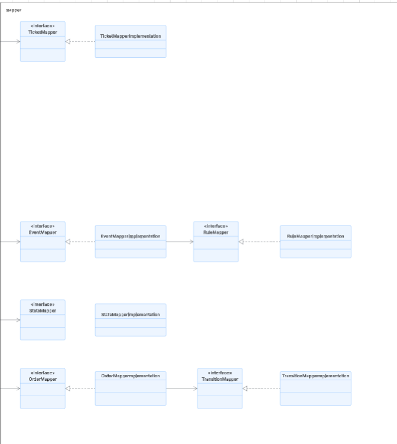
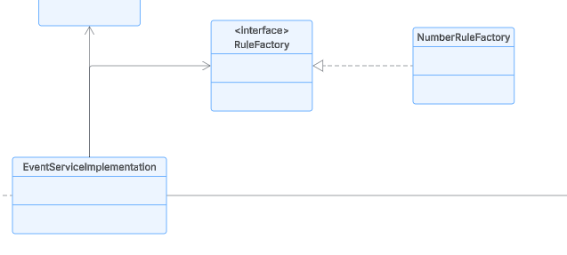
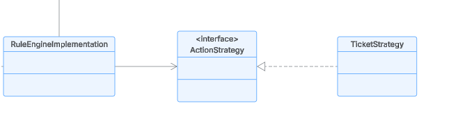

# StateMachineApp

## Architecture

At a high level, the system consists of a **single-page application (SPA)** client that communicates with a **FastAPI** backend. The client sends HTTP requests for CRUD operations and establishes a **WebSocket** connection to receive real-time state updates for orders.


### Frontend

The frontend is a **React + TypeScript** application organised into several layers, each with a clear responsibility:

- **`components/`** – Reusable presentational units (e.g., tables, modals, forms). They receive data via props and emit events.
- **`hooks/`** – Custom React hooks that encapsulate stateful logic and side effects (e.g., fetching orders, managing WebSocket connections).
- **`models/`** – TypeScript interfaces that define the shape of data (Order, Ticket, Event, etc.).
- **`pages/`** – Full-page components that combine hooks and components to implement specific views (OrdersPage, TicketsPage, EventsPage).
- **`routes/`** – Routing configuration using React Router, including protected layouts and navigation.
- **`services/`** – Modules that abstract all API and WebSocket communication (e.g., `orderService`, `eventService`, `createOrderSocket`).
- **`context/`** – Global state management for cross-cutting concerns (currently not used, but ready for future needs).

This layered structure ensures **separation of concerns**, **reusability**, and **testability**.

### Backend

The backend is built with **FastAPI** and follows a multi‑layer architecture to keep the codebase maintainable and scalable.


- **Routes** – Define the API endpoints, handle request validation, and delegate to services. Each route returns an `APIResponse` envelope.

*

- **Services** – Contain the **core business logic**. Services orchestrate operations, apply rules, trigger state transitions, and manage transactions. They depend on repositories and mappers, never directly on the database.


- **Repositories** – Abstract all database interactions. They use mappers to convert between MongoDB documents and domain models. This layer isolates the database technology (MongoDB) from the rest of the application.


- **Schemas** – Pydantic models that define the structure of data **transferred over the wire**. They ensure consistent request/response formats and provide automatic validation.

- **Mappers** – Convert between **domain models** (used inside services) and **schemas** (used at the API boundary) as well as between **domain models** and **database documents**. This decouples the internal representation from external contracts and database storage.




- **Models** – Plain Python classes (or dataclasses) that represent the core business entities (e.g., `Order`, `Event`, `Rule`). They are independent of any framework or storage mechanism.


## Design

The application implements several design patterns to achieve **scalability**, **modifiability**, and **clean separation of concerns**.

### Repository Pattern

The repository pattern completely decouples the business logic from the database implementation. Services only know about repositories, not about MongoDB collections or queries. This makes it easy to swap the database or write unit tests without a real database.


### Dependency Injection

No component directly instantiates its dependencies; instead, all dependencies are provided via constructors or function parameters (using FastAPI’s `Depends`). This follows the **Dependency Inversion Principle** – high-level modules depend on abstractions (interfaces), not on concrete implementations.


### Factory Pattern (for Rule Creation)

Rules can be of different types (e.g., `NUMBER`, `STRING`, `DATE`). The **Factory pattern** centralises rule creation. The `RuleFactory` registry allows new rule types to be added without modifying existing code – just register a new factory class.



### Strategy Pattern (for Rule Actions)

When a rule is satisfied, one or more **actions** are executed (e.g., `TICKET`, `NOTIFY`, `ESCALATE`). The **Strategy pattern** encapsulates each action as a separate strategy. This enables:
- Adding new actions without changing existing rules.
- Dynamically assigning any combination of actions to a rule.
- Isolating action logic for easy testing.



### Data Mapping Layer

Mappers are explicitly used to transform data between three representations:
- **MongoDB document** (raw BSON)
- **Domain model** (business entity)
- **API schema** (Pydantic model)

This prevents “leaky abstractions” – the service never sees a MongoDB document or a Pydantic schema. It only works with clean domain models.


All these patterns together make the system **loosely coupled**, **highly cohesive**, and ready for future extensions.

## Functionality

The application manages **orders** that go through a state machine. Key features:

- **Create an order** – Specify a list of product IDs and the total amount.
- **View all orders** – See current state, amount, and available transitions.
- **Update order state** – Trigger an event (e.g., `approve`, `ship`, `deliver`) with optional metadata.
- **Real-time monitoring** – Open a modal that connects via WebSocket to watch an order’s state changes live.
- **Ticket system** – When certain rule actions are triggered, a ticket is generated.
- **Event & Rule management** – Define events (transitions) and attach conditional rules (e.g., if metadata.amount > 1000, create a ticket, for now, the plan is only to create tickets and rules using numbers, but the design is intended to be expanded).

The frontend displays a dashboard with three sections: **Orders**, **Tickets**, and **Events**.

## How to Run

### Prerequisites
- Docker & Docker Compose

### Steps

1. **Clone the repository**
   ```bash
   git clone <repository-url>
   cd StateMachineApp
   ```
Adjust MongoDB credentials in StateMachine/.env if required.

2. **Build and run all services**
    ```bash
   docker-compose up -d --build
   ```

3. **Access the application**
- Frontend: http://localhost:5173
- Backend API: http://localhost:8000/docs (Swagger UI)

### Stopping the application

```bash
docker-compose down
 ```
To also remove data volumes (reset the database):
```bash
docker-compose down -v
 ```

## How to view logs

### Backend logs(FastAPI)
```bash
docker logs mi_app_fastapi -f
 ```

### Frontend logs (React)
 ```bash
docker logs mi_app_frontend -f
 ```

### MongoDB logs
 ```bash
docker logs mi_app_mongo -f
 ```
